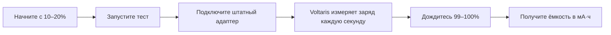

# Voltaris Battery Lab

[](https://github.com/964nbtrkhb-eng/Voltaris-Battery-Lab/releases/latest)
[](https://github.com/964nbtrkhb-eng/Voltaris-Battery-Lab/releases/latest)
[](https://dotnet.microsoft.com/)
[](LICENSE)

## Узнайте, сколько энергии аккумулятор ноутбука принимает на самом деле

Voltaris — нативное приложение для Windows 10/11, которое раз в секунду показывает телеметрию батареи и измеряет её фактическую ёмкость в **мА·ч** во время обычной зарядки.

> **Не гадайте по проценту износа.** Зарядите ноутбук с низкого уровня до 99–100% — Voltaris посчитает принятую энергию, оценит точность и сохранит результат локально.

[**Скачать Voltaris для Windows x64**](https://github.com/964nbtrkhb-eng/Voltaris-Battery-Lab/releases/latest) · [Посмотреть исходный код](src/Voltaris) · [Сообщить о проблеме](https://github.com/964nbtrkhb-eng/Voltaris-Battery-Lab/issues)

| Обычный отчёт Windows | Voltaris |
|---|---|
| Показывает паспортную и последнюю полную ёмкость | Дополнительно измеряет энергию, принятую во время зарядки |
| Даёт снимок состояния | Обновляет заряд, ток, напряжение и мощность каждую секунду |
| Не объясняет качество замера | Оценивает точность по пройденному диапазону заряда и доступным датчикам |
| Не хранит удобную историю тестов | Сохраняет результаты локально и экспортирует их в CSV |



## Быстрый старт

1. Откройте [последний релиз](https://github.com/964nbtrkhb-eng/Voltaris-Battery-Lab/releases/latest).
2. Скачайте файл `Voltaris-Setup-1.0.1.exe` и установите приложение.
3. Запустите Voltaris при заряде около 10–20%.
4. Нажмите **«Измерить реальную ёмкость»** и пройдите короткий 7‑секундный инструктаж.
5. Подключите штатный адаптер и оставьте ноутбук заряжаться до 99–100%.

Установщик автономный: пользователю не нужно отдельно ставить .NET. Установка выполняется для текущего пользователя и не требует прав администратора.

> [!IMPORTANT]
> Публичный установщик пока не подписан цифровым сертификатом. Windows SmartScreen может показать предупреждение. Загружайте файл только со страницы релизов этого репозитория и сверяйте SHA-256, указанный в описании релиза.

## Что показывает Voltaris

- текущий заряд и состояние питания;
- напряжение, ток и мощность зарядки или разрядки;
- оставшуюся энергию батареи;
- температуру, если датчик доступен через ACPI;
- заводскую и последнюю полную ёмкость из отчёта Windows;
- OEM-счётчик циклов, если его сообщает прошивка;
- собственный счётчик эквивалентных циклов;
- историю измерений с экспортом в CSV.

Приложение продолжает обновлять показания в системном трее и во время теста не даёт Windows автоматически перевести компьютер в сон.

## Как измеряется реальная ёмкость

Windows сообщает мощность батареи в милливаттах и напряжение в милливольтах. Voltaris вычисляет ток:

```text
I = P / U
```

Затем приложение интегрирует ток по времени между последовательными показаниями и получает реально принятые **мА·ч**. Одновременно сохраняются энергия в **мВт·ч**, средняя и пиковая мощность, длительность теста и число образцов.

Если контроллер ноутбука не отдаёт ток, Voltaris использует изменение оставшейся энергии ACPI как резервный метод и честно снижает оценку точности.

Для частичного теста результат экстраполируется по пройденной разнице заряда:

```text
оценочная ёмкость = принятые мА·ч × 100 / набранные проценты
```

### Как получить наиболее точный результат

- Начните с 10–20%; разряжать батарею строго до 1% не нужно.
- Используйте штатный или заведомо подходящий адаптер.
- Доведите заряд до 99–100%.
- Не запускайте игры и тяжёлые задачи во время теста.
- Не меняйте лимит зарядки и не отключайте адаптер до завершения.
- Для хорошей точности пройдите не менее 50 процентных пунктов, для высокой — около 80 и более.

## Оценка точности

| Пройденный диапазон | Когда доступен ток | Резервный метод ACPI |
|---:|---|---|
| 80% и более | Высокая | Хорошая |
| 50–79% | Хорошая | Оценочная |
| 20–49% | Оценочная | Низкая |
| 5–19% | Низкая | Низкая |

Минимальный диапазон для ручного завершения теста — 5%. Для осмысленного сравнения состояния батареи лучше проводить полный тест в одинаковых условиях.

## Честные ограничения

- Voltaris измеряет энергию, которую сообщает контроллер батареи, а не лабораторный ток на физических контактах аккумулятора.
- Температура, OEM-циклы, ток и часть характеристик зависят от ACPI-прошивки конкретного ноутбука.
- Частичный тест является экстраполяцией и чувствительнее к нелинейности индикатора заряда.
- Фоновые нагрузки, нагрев, USB Power Delivery и ограничения производителя могут влиять на результат.
- Приложение не изменяет лимит зарядки, режим питания, напряжение или работу контроллера батареи.

## Приватность и данные

Voltaris работает локально, не требует аккаунта и не отправляет телеметрию в интернет.

История хранится в файле:

```text
%LOCALAPPDATA%\Voltaris\state.json
```

Удаление этого файла сбрасывает локальную историю и наблюдаемый счётчик циклов.

## Системные требования

- Windows 10 или Windows 11;
- 64-разрядный процессор;
- ноутбук или устройство с батареей, доступной через Windows ACPI;
- права администратора не требуются.

## Сборка из исходного кода

Разработчику понадобятся [.NET 8 SDK](https://dotnet.microsoft.com/download/dotnet/8.0) и Inno Setup 7 или 6.

```powershell
git clone https://github.com/964nbtrkhb-eng/Voltaris-Battery-Lab.git
cd Voltaris-Battery-Lab
.\build.cmd
```

Сценарий восстанавливает зависимости, собирает решение, запускает самопроверку, создаёт автономный single-file executable и установщик.

Результаты:

- `artifacts/publish/Voltaris.exe` — автономное приложение Windows x64;
- `artifacts/installer/Voltaris-Setup-1.0.1.exe` — установщик для текущего пользователя.

Сборка без установщика:

```powershell
.\build.cmd -SkipInstaller
```

### Подпись релиза

Если в хранилище `Cert:\CurrentUser\My` установлен доверенный сертификат подписи кода с закрытым ключом, сборка может подписать и приложение, и установщик:

```powershell
.\build.cmd -SignThumbprint ВАШ_ОТПЕЧАТОК_СЕРТИФИКАТА
```

Подпись выполняется алгоритмом SHA-256 с меткой времени. Без параметра `-SignThumbprint` сборка остаётся неподписанной.

## Структура проекта

```text
src/Voltaris/                 WPF-приложение и интерфейс
src/Voltaris/Services/        телеметрия, измерение и локальное хранение
tests/Voltaris.SelfTest/      самопроверка вычислений
installer/Voltaris.iss        сценарий установщика
scripts/                      генерация ресурсов
build.ps1                     полный сценарий сборки
```

## English summary

Voltaris Battery Lab is a local-first Windows 10/11 desktop app for live battery telemetry and real-world capacity estimation in mAh. It samples ACPI data every second, integrates charging current over time, supports partial-test extrapolation, stores results locally, and exports history to CSV. Download the [latest Windows x64 release](https://github.com/964nbtrkhb-eng/Voltaris-Battery-Lab/releases/latest).

## Лицензия

[MIT](LICENSE)
